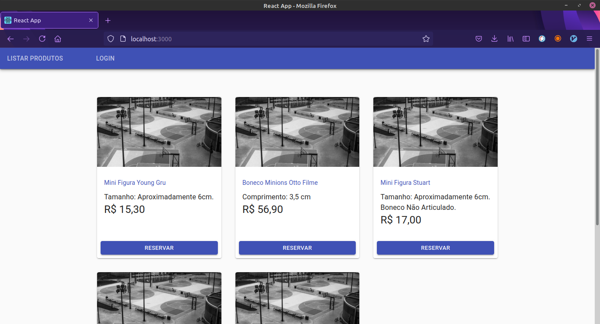
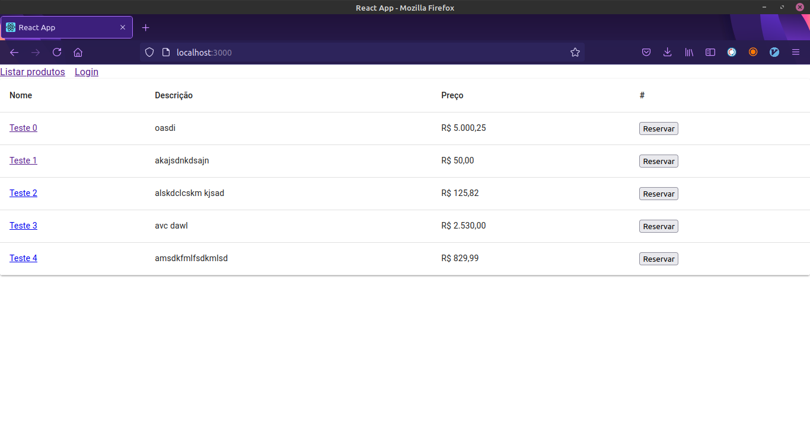
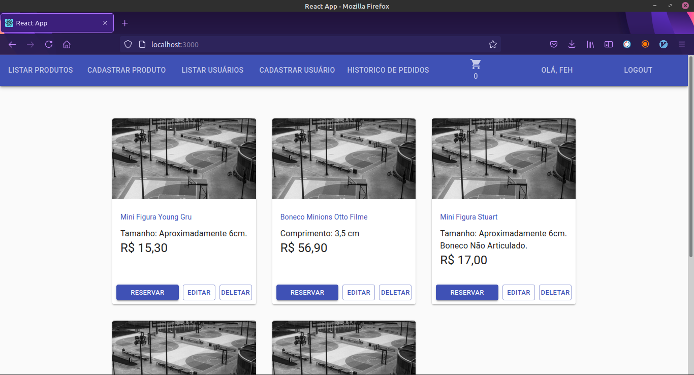
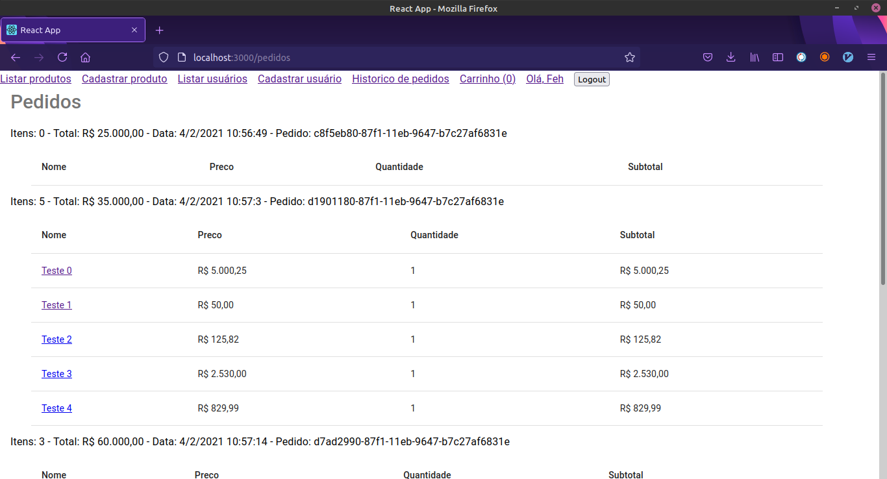
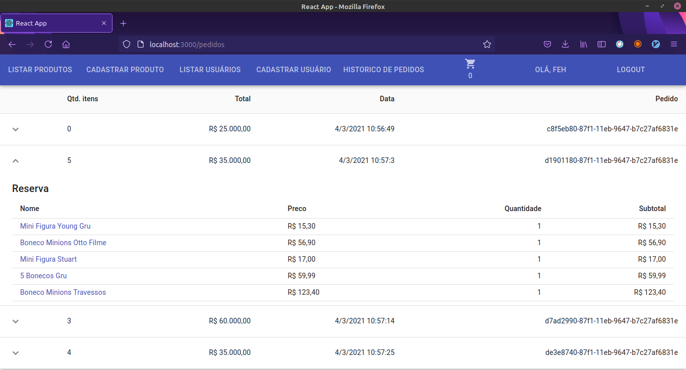

## Desafio GBC Loja

[Teste o site clicando aqui ;)](http://bgc-frontend.s3-website-sa-east-1.amazonaws.com/)

# Conteudos

- [Screenshots](#v30-e-v20)
- [Como usar](#como-usar)

# v3.0 e v2.0

<p align="center">
   
   
</p>

<p align="center">
   
   
</p>

<p align="center">
   
   
</p>

[Vídeo da versão 3.0](https://youtu.be/_owP1BYJytY)

[Vídeo da versão 2.0](https://youtu.be/kWpBPtolxFw)

# Como usar

> **Nota:** para usar o bgc-frontend, [instale o bgc-backend-serverless](https://github.com/felippedesouza/bgc-backend-serverless)

```
git clone https://github.com/felippedesouza/bgc-frontend.git
cd bgc-frontend
npm install
npm run start
```